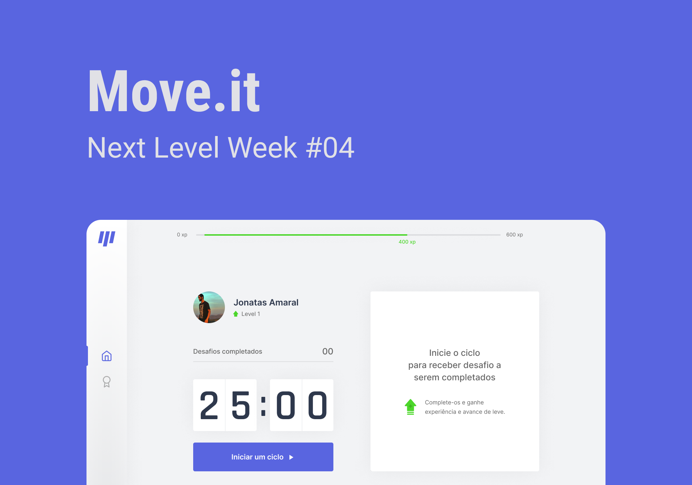
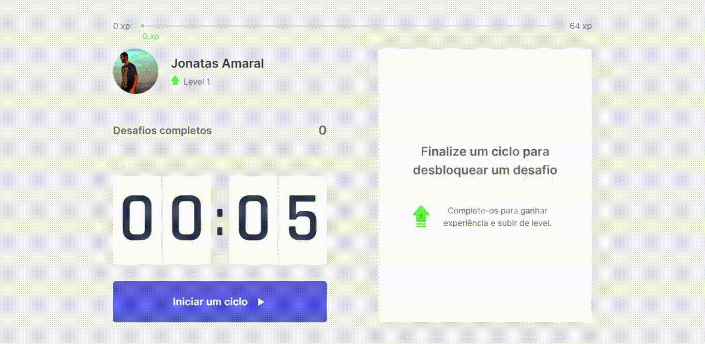
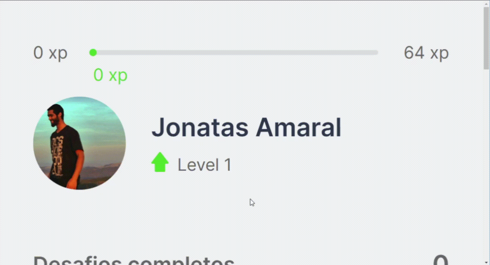

<p align="center">
 <a href="#what">What is it</a> •
 <a href="#technologies">Technologies</a> • 
 <a href="#using">Using</a> • 
 <a href="#building">Build one yourself</a> • 
 <a href="#author">Author</a>
</p>

<p align="center">
 
 
 
 <span style="border-left: 3px solid #555; margin-right: 2px;"></span>
 
 

</p>


<!-- 
 -->

<p align="center"> 
	🚧  app in development...  🚧
</p>

<h1 align="center">
    Typescript React/Next app:
    <p><b>move.it</b></p>
</h1>


A webapp for a gamified pomodoro technique. Created in the [NLW#4](https://nextlevelweek.com/) event from _22_ to _26 feb, 2021_.




<h2 id="what" > What is it </h2>

A React/NextJS app developed in a online event [NLW#4](https://nextlevelweek.com/) (Next Level Week, 4th edition), by the programming online school [Rocketseat](https://rocketseat.com.br/).

<br />

### Easy and better

The app help you use the [pomodoro technique](https://en.wikipedia.org/wiki/Pomodoro_Technique) to your work time, along with some gamification stimulus, and health care.

On each 25 minutes work section you finish, you unlock a challenge: an exercice for body or eyes, each give you some amount of XP points if completed, getting enought XP you will level up. Each level gets harder to reach.


You can check it running over [here](https://nlw-4-react-app.vercel.app/)

### What you will find in it

* Countdown _min : sec_ timer
* Completed challenges counter
* User info: picture, name and level indicator
* Experience bar indicator, with fine transitions
* XP value counter dinamicaly ajusting to bar size and boundaries.
  - It doesn't overflow
  - Align itself at right from bar' end when it is to small
  - Align itself at left from bar' end when it is to large
  - Perfer to keep it's middle on bar' end though
* Dinamic single button with icon
  - Pretty vivid themed start button
  - The button while running turns into a stop one. Clear flat on normal, strong red on hover
  - Small bar on button border indicanting time
  - Descriptive though disabled on time end, but not atempt to the challenge yet
* Persist user info on local machine by cookies
* Level up modal, with share button using native browser API, to share by any method (enabled over ssh only)





<h2 id="using" > Using it </h2>

The most recent state of this project is automatically build to [vercel](vercel.com):

You can run it at: [https://nlw-4-react-app.vercel.app/](https://nlw-4-react-app.vercel.app/)


<h2 id="technologies"> Applyed Technologies </h2>

### This project has the following dependencies

production
- [ReactJS](https://reactjs.org)
- [NextJS](https://nextjs.org)
- [js-cookie](https://www.npmjs.com/package/js-cookie)

development
- [typescript](https://www.typescriptlang.org/)
- [NodeJS](https://nodejs.org/en/)
- [Yarn](https://yarnpkg.com) or [Npm](https://npmjs.com)

### tool set usage

* Extensive use of React's State and Context APIs, along with some Effect API.
* Some minor usage of Refs API too.
* Css modules for component escoped styling.
* Css Grid layout and Flexbox.
* Css custom properties (variables).
* NextJS's getServerSideProps for server side renderind.
* Cookies for local storage of user stats.
* Font icons for light weight loadings, personalization, and easy fallback to emoji/symbol. Custom set created with [icomoon](https://icomoon.io/)

### What is comming ahead

1. Enable editing the work section time.
0. Night mode,and other themes.
0. Optional login with github and other social media (straight anonyous usage will still be suported, and the first page for new access).
0. Give user (primordially those with higher levels) a little XP for time of work, even without doing the challenges.
0. Custom sharing options beyond the not widelly suported browser API.
0. Making a ranking of logged users, by generally, month, and week.
0. Image generator for social sharing in app accomplishes.
0. User info synchronization across devices, over social media login. (At frist, temporarily, by manual user action, for scheduled devide formating and correlated situations)
0. User created goals

<h2 id="building" > Make yourself one of these </h2>

### On Gitpod

The easy way to get your hand at the code, is clone this repo to a cointainer in the cloud.
If you already have an account:

[](https://gitpod.io/#https://github.com/JonatasAmaral/NLW4-REACT-app.git)

### On your local machine

To do it locally, you need to install git and NodeJS. I'm using yarn to build, though you can use npm.

```bash
# Clone this repo
$ git clone https://github.com/JonatasAmaral/NLW4-REACT-app.git

# Open folder (rename it before, if you want to)
$ cd NLW4-REACT-app

# Install/update the dependencies
$ yarn

# Or, for npm
$ npm install

# Run it
$ yarn dev

# Or
$ npm dev

# Access localhost
http://localhost:3000
```

<br />
<h2 id="author"> About the author </h2>


### Jonatas Amaral

[](https://www.linkedin.com/in/anabrtorres/)
[](https://www.artstation.com/jonatasamaral)

[](mailto:anabrtorres19@gmail.com)

<p style="white-space: nowrap">Designer, Computer Engeneering student.<p>
<br style="clear: both; margin-top: 1rem" />

<h2 id="license"> License </h2>

This project is under the [MIT license](https://opensource.org/licenses/MIT).
